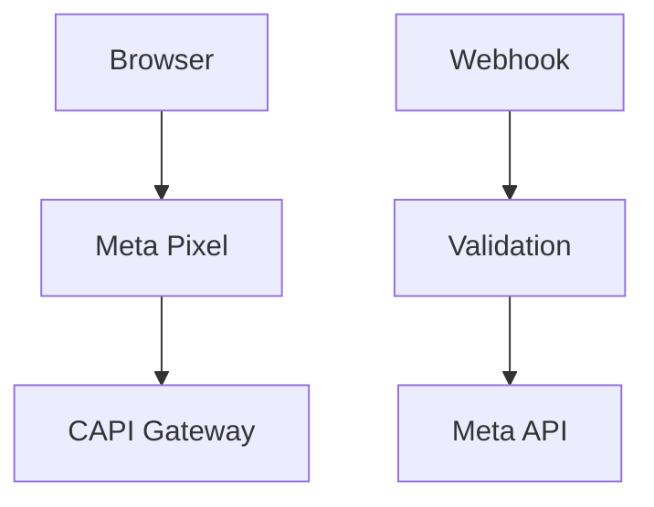

# 🎯 Roadmap para 10/10 - Sistema de Tracking

## 📊 Score Atual vs. Score Alvo

| Dimensão | Atual | Alvo | Gap | Prioridade |
|----------|-------|------|-----|------------|
| **Arquitetura** | 8/10 | 10/10 | 2.0 | 🟡 Média |
| **Qualidade de Código** | 8/10 | 10/10 | 2.0 | 🟡 Média |
| **Segurança** | 8/10 | 10/10 | 2.0 | 🔴 Alta |
| **Performance** | 7/10 | 10/10 | 3.0 | 🟡 Média |
| **Manutenibilidade** | 8/10 | 10/10 | 2.0 | 🟡 Média |
| **Testabilidade** | 3/10 | 10/10 | 7.0 | 🔴 **CRÍTICA** |
| **Observabilidade** | 7/10 | 10/10 | 3.0 | 🟡 Média |
| **Documentação** | 5/10 | 10/10 | 5.0 | 🟡 Média |
| **CI/CD** | 0/10 | 10/10 | 10.0 | 🟡 Média |
| **TypeScript Strict** | 4/10 | 10/10 | 6.0 | 🟡 Média |

**Score Geral Atual:** 7.2/10  
**Score Geral Alvo:** 10/10  
**Gap Total:** 2.8 pontos

---

## 🔴 CRÍTICO - Testabilidade (3/10 → 10/10)

### ❌ O que falta:

1. **Testes Unitários (0% cobertura)**
   - Nenhum teste encontrado no projeto
   - Funções críticas sem testes
   - Sem garantia de que código funciona

2. **Testes de Integração**
   - Webhooks não testados
   - APIs não testadas
   - Fluxos end-to-end não validados

3. **Testes de Performance**
   - Sem benchmarks
   - Sem testes de carga
   - Sem métricas de latência

4. **Testes de Segurança**
   - Sem validação de hash
   - Sem testes de sanitização
   - Sem testes de rate limiting

### ✅ O que implementar:

```typescript
// tests/lib/hashing.test.ts
describe('Hashing System', () => {
  it('should hash email consistently', async () => {
    const hash1 = await hashData('user@example.com');
    const hash2 = await hashData('user@example.com');
    expect(hash1).toBe(hash2);
  });
  
  it('should normalize before hashing', async () => {
    const hash1 = await hashData('User@EXAMPLE.COM');
    const hash2 = await hashData('user@example.com');
    expect(hash1).toBe(hash2);
  });
});

// tests/lib/normalization.test.ts
describe('Normalization System', () => {
  it('should normalize phone with country code', () => {
    const normalized = normalizePhone('(11) 99999-9999', true);
    expect(normalized).toBe('5511999999999');
  });
  
  it('should separate first and last name', () => {
    const { firstName, lastName } = normalizeName('João Silva Santos');
    expect(firstName).toBe('joão');
    expect(lastName).toBe('silva santos');
  });
});

// tests/lib/meta-pixel.test.ts
describe('Meta Pixel Events', () => {
  it('should fire PageView with complete user_data', async () => {
    const result = await firePageViewDefinitivo();
    expect(result.success).toBe(true);
    expect(result.eventId).toBeDefined();
  });
  
  it('should validate event before sending', async () => {
    const invalidEvent = { event_name: '', user_data: {} };
    const validation = validateMetaEvent(invalidEvent);
    expect(validation.success).toBe(false);
  });
});

// tests/api/webhook-cakto.test.ts
describe('Cakto Webhook', () => {
  it('should process purchase_approved event', async () => {
    const event = { event: 'purchase_approved', data: {...} };
    const response = await POST(new NextRequest(...));
    expect(response.status).toBe(200);
  });
  
  it('should prevent duplicate events', async () => {
    // Test duplicate prevention
  });
  
  it('should validate secret', async () => {
    // Test secret validation
  });
});
```

**Impacto:** +7.0 pontos (3/10 → 10/10)

**Esforço:** 2-3 semanas  
**Prioridade:** 🔴 **CRÍTICA**

---

## 🟡 ALTA - Refatoração de Funções Grandes

### ❌ O que falta:

1. **`webhook-cakto/route.ts` - 858 linhas**
   - Função gigante com múltiplas responsabilidades
   - Difícil de testar
   - Difícil de manter

2. **`meta-pixel-definitivo.ts` - 503 linhas**
   - Função `fireMetaEventDefinitivo` muito grande
   - Múltiplas responsabilidades

### ✅ O que implementar:

```typescript
// src/app/api/webhook-cakto/handlers/purchase.ts
export async function handlePurchaseApproved(
  data: PurchaseData,
  requestId: string
): Promise<PurchaseResult> {
  // Lógica isolada
}

// src/app/api/webhook-cakto/handlers/abandonment.ts
export async function handleCheckoutAbandonment(
  data: AbandonmentData,
  requestId: string
): Promise<AbandonmentResult> {
  // Lógica isolada
}

// src/lib/meta-pixel/event-builder.ts
export class MetaEventBuilder {
  private userData: MetaFormattedUserData;
  private enrichment: EnrichmentData;
  
  withUserData(data: MetaFormattedUserData): this {
    this.userData = data;
    return this;
  }
  
  withEnrichment(data: EnrichmentData): this {
    this.enrichment = data;
    return this;
  }
  
  build(): MetaEvent {
    // Construção do evento
  }
}

// src/lib/meta-pixel/event-dispatcher.ts
export class MetaEventDispatcher {
  async dispatch(event: MetaEvent): Promise<EventResult> {
    // Disparo do evento
  }
}
```

**Impacto:** +1.0 ponto (8/10 → 9/10)

**Esforço:** 1 semana  
**Prioridade:** 🟡 Alta

---

## 🟡 ALTA - TypeScript Strict Mode

### ❌ O que falta:

1. **`noImplicitAny: false`** no tsconfig.json
2. **`ignoreBuildErrors: true`** no next.config.ts
3. **Uso excessivo de `any`** no código

### ✅ O que implementar:

```typescript
// tsconfig.json
{
  "compilerOptions": {
    "strict": true,
    "noImplicitAny": true,  // ✅ Habilitar
    "strictNullChecks": true,
    "strictFunctionTypes": true
  }
}

// next.config.ts
{
  typescript: {
    ignoreBuildErrors: false  // ✅ Não ignorar erros
  }
}

// Remover todos os `any`
// ANTES:
function processData(data: any): any { }

// DEPOIS:
function processData<T extends UserData>(data: T): ProcessedData<T> { }
```

**Impacto:** +1.5 pontos (qualidade geral)

**Esforço:** 1-2 semanas (corrigir tipos gradualmente)  
**Prioridade:** 🟡 Alta

---

## 🟡 MÉDIA - Observabilidade Completa

### ❌ O que falta:

1. **Métricas estruturadas**
   - Sem sistema de métricas centralizado
   - Logs não estruturados
   - Sem dashboards

2. **Tracing distribuído**
   - Sem correlation IDs
   - Difícil rastrear fluxos completos

3. **Alertas automáticos**
   - Sem alertas de falhas
   - Sem alertas de performance

### ✅ O que implementar:

```typescript
// src/lib/monitoring/metrics.ts
export class MetricsCollector {
  recordEvent(eventName: string, metadata: EventMetadata): void {
    // Enviar para sistema de métricas (DataDog, New Relic, etc)
  }
  
  recordError(error: Error, context: ErrorContext): void {
    // Enviar para error tracking (Sentry, etc)
  }
  
  recordPerformance(metric: string, value: number): void {
    // Enviar métricas de performance
  }
}

// src/lib/monitoring/tracing.ts
export function withTracing<T>(
  operation: string,
  fn: () => Promise<T>
): Promise<T> {
  const traceId = generateTraceId();
  // Iniciar trace
  try {
    const result = await fn();
    // Finalizar trace com sucesso
    return result;
  } catch (error) {
    // Finalizar trace com erro
    throw error;
  }
}

// src/lib/monitoring/alerts.ts
export class AlertManager {
  checkThresholds(metrics: Metrics): void {
    if (metrics.errorRate > 0.05) {
      this.sendAlert('HIGH_ERROR_RATE', metrics);
    }
    if (metrics.avgLatency > 1000) {
      this.sendAlert('HIGH_LATENCY', metrics);
    }
  }
}
```

**Impacto:** +3.0 pontos (7/10 → 10/10)

**Esforço:** 2 semanas  
**Prioridade:** 🟡 Média

---

## 🟡 MÉDIA - Documentação Completa

### ❌ O que falta:

1. **Documentação de API**
   - Sem OpenAPI/Swagger
   - Endpoints não documentados
   - Parâmetros não explicados

2. **Documentação de Arquitetura**
   - Fluxos não documentados
   - Decisões de design não registradas
   - Diagramas faltando

3. **Guias de Desenvolvimento**
   - Sem guia de contribuição
   - Sem guia de setup
   - Sem guia de troubleshooting

### ✅ O que implementar:

```markdown
# docs/API.md
## Endpoints

### POST /api/webhook-cakto
Processa eventos da Cakto...

### POST /api/meta-conversions
Envia eventos para Meta Conversions API...

# docs/ARCHITECTURE.md
## Fluxo de Eventos



# docs/CONTRIBUTING.md
## Como Contribuir

1. Setup do ambiente
2. Executar testes
3. Criar PR
```

**Impacto:** +5.0 pontos (5/10 → 10/10)

**Esforço:** 1 semana  
**Prioridade:** 🟡 Média

---

## 🟡 MÉDIA - CI/CD Pipeline

### ❌ O que falta:

1. **CI Pipeline**
   - Sem testes automáticos
   - Sem linting automático
   - Sem type checking

2. **CD Pipeline**
   - Deploy manual
   - Sem staging environment
   - Sem rollback automático

### ✅ O que implementar:

```yaml
# .github/workflows/ci.yml
name: CI
on: [push, pull_request]
jobs:
  test:
    runs-on: ubuntu-latest
    steps:
      - uses: actions/checkout@v3
      - uses: actions/setup-node@v3
      - run: npm ci
      - run: npm run lint
      - run: npm run type-check
      - run: npm run test
      - run: npm run test:coverage
  
  build:
    runs-on: ubuntu-latest
    steps:
      - uses: actions/checkout@v3
      - run: npm ci
      - run: npm run build

# .github/workflows/cd.yml
name: CD
on:
  push:
    branches: [main]
jobs:
  deploy:
    runs-on: ubuntu-latest
    steps:
      - uses: actions/checkout@v3
      - run: npm ci
      - run: npm run build
      - run: npm run deploy
```

**Impacto:** +2.0 pontos (automação e confiabilidade)

**Esforço:** 1 semana  
**Prioridade:** 🟡 Média

---

## 🟡 MÉDIA - Performance Avançada

### ❌ O que falta:

1. **Cache com TTL para geolocalização**
   - Já existe `geolocation-cache.ts` mas pode melhorar
   - Sem invalidação inteligente

2. **Lazy Loading**
   - Enriquecimento carregado sempre
   - Pode ser carregado sob demanda

3. **Debouncing de eventos**
   - Múltiplos eventos disparados rapidamente
   - Pode causar rate limiting

### ✅ O que implementar:

```typescript
// src/lib/cache/geolocation-cache.ts (melhorar)
export class GeolocationCache {
  private cache = new Map<string, CachedLocation>();
  private ttl = 24 * 60 * 60 * 1000; // 24 horas
  
  async get(key: string): Promise<LocationData | null> {
    const cached = this.cache.get(key);
    if (cached && Date.now() - cached.timestamp < this.ttl) {
      return cached.data;
    }
    return null;
  }
  
  async set(key: string, data: LocationData): Promise<void> {
    this.cache.set(key, {
      data,
      timestamp: Date.now()
    });
    
    // Limpeza automática de itens expirados
    this.cleanExpired();
  }
  
  private cleanExpired(): void {
    const now = Date.now();
    for (const [key, value] of this.cache.entries()) {
      if (now - value.timestamp > this.ttl) {
        this.cache.delete(key);
      }
    }
  }
}

// src/lib/meta-pixel/event-debouncer.ts
export class EventDebouncer {
  private pendingEvents = new Map<string, EventData>();
  
  debounce(eventName: string, data: EventData, delay: number = 300): void {
    const key = `${eventName}_${data.user_data?.external_id}`;
    
    if (this.pendingEvents.has(key)) {
      clearTimeout(this.pendingEvents.get(key)!.timeout);
    }
    
    const timeout = setTimeout(() => {
      this.fireEvent(eventName, data);
      this.pendingEvents.delete(key);
    }, delay);
    
    this.pendingEvents.set(key, { ...data, timeout });
  }
}
```

**Impacto:** +3.0 pontos (7/10 → 10/10)

**Esforço:** 1 semana  
**Prioridade:** 🟡 Média

---

## 🟡 MÉDIA - Rate Limiting

### ❌ O que falta:

1. **Rate limiting nas APIs**
   - Webhooks podem ser abusados
   - APIs públicas sem proteção

### ✅ O que implementar:

```typescript
// src/lib/rate-limiting/rate-limiter.ts
export class RateLimiter {
  private requests = new Map<string, number[]>();
  
  check(identifier: string, limit: number, window: number): boolean {
    const now = Date.now();
    const requests = this.requests.get(identifier) || [];
    
    // Remover requisições antigas
    const recent = requests.filter(time => now - time < window);
    
    if (recent.length >= limit) {
      return false; // Rate limit excedido
    }
    
    recent.push(now);
    this.requests.set(identifier, recent);
    return true;
  }
}

// src/app/api/webhook-cakto/route.ts
const rateLimiter = new RateLimiter();

export async function POST(request: NextRequest) {
  const ip = request.headers.get('x-forwarded-for') || 'unknown';
  
  if (!rateLimiter.check(ip, 100, 60000)) { // 100 req/min
    return NextResponse.json(
      { error: 'Rate limit exceeded' },
      { status: 429 }
    );
  }
  
  // Processar webhook...
}
```

**Impacto:** +1.0 ponto (segurança)

**Esforço:** 2-3 dias  
**Prioridade:** 🟡 Média

---

## 🟡 MÉDIA - Correlação de Eventos via DB

### ❌ O que falta:

1. **Event IDs não compartilhados entre browser e webhook**
   - InitiateCheckout (browser) e Purchase (webhook) não correlacionados
   - Meta não consegue rastrear funil completo

### ✅ O que implementar:

```typescript
// src/lib/event-correlation/event-store.ts
export class EventStore {
  async saveEvent(event: EventData): Promise<void> {
    await db.event.create({
      data: {
        eventId: event.event_id,
        eventName: event.event_name,
        userId: event.user_data.external_id,
        timestamp: new Date(event.event_time * 1000),
        metadata: event.custom_data
      }
    });
  }
  
  async getCorrelatedEvents(userId: string): Promise<EventData[]> {
    return db.event.findMany({
      where: { userId },
      orderBy: { timestamp: 'asc' }
    });
  }
  
  async getLastCheckoutEvent(userId: string): Promise<EventData | null> {
    return db.event.findFirst({
      where: {
        userId,
        eventName: 'InitiateCheckout'
      },
      orderBy: { timestamp: 'desc' }
    });
  }
}

// No webhook, usar event_id do InitiateCheckout
const checkoutEvent = await eventStore.getLastCheckoutEvent(userId);
const purchaseEventId = checkoutEvent 
  ? `${checkoutEvent.eventId}_purchase`
  : generateNewEventId();
```

**Impacto:** +1.5 pontos (qualidade de dados)

**Esforço:** 1 semana  
**Prioridade:** 🟡 Média

---

## 📋 Resumo de Implementação

### Prioridade 🔴 CRÍTICA (Fazer Primeiro)

1. **Testes Automatizados** - +7.0 pontos
   - Esforço: 2-3 semanas
   - Impacto: Maior gap (3/10 → 10/10)

### Prioridade 🟡 ALTA (Fazer em Seguida)

2. **TypeScript Strict Mode** - +1.5 pontos
   - Esforço: 1-2 semanas
   
3. **Refatoração de Funções Grandes** - +1.0 ponto
   - Esforço: 1 semana

### Prioridade 🟡 MÉDIA (Fazer Depois)

4. **Observabilidade Completa** - +3.0 pontos
   - Esforço: 2 semanas

5. **Documentação Completa** - +5.0 pontos
   - Esforço: 1 semana

6. **CI/CD Pipeline** - +2.0 pontos
   - Esforço: 1 semana

7. **Performance Avançada** - +3.0 pontos
   - Esforço: 1 semana

8. **Rate Limiting** - +1.0 ponto
   - Esforço: 2-3 dias

9. **Correlação de Eventos** - +1.5 pontos
   - Esforço: 1 semana

---

## 🎯 Plano de Ação Recomendado

### Fase 1: Fundação (4-5 semanas)
1. ✅ Testes Automatizados (2-3 semanas)
2. ✅ TypeScript Strict Mode (1-2 semanas)

**Resultado:** 7.2/10 → **8.5/10**

### Fase 2: Qualidade (3-4 semanas)
3. ✅ Refatoração de Funções (1 semana)
4. ✅ Observabilidade (2 semanas)
5. ✅ Documentação (1 semana)

**Resultado:** 8.5/10 → **9.5/10**

### Fase 3: Excelência (2-3 semanas)
6. ✅ CI/CD Pipeline (1 semana)
7. ✅ Performance Avançada (1 semana)
8. ✅ Rate Limiting + Correlação (1 semana)

**Resultado:** 9.5/10 → **10/10** 🎉

---

## 📊 Estimativa Total

- **Tempo Total:** 9-12 semanas
- **Esforço:** Médio-Alto
- **Impacto:** 7.2/10 → 10/10
- **ROI:** Alto (sistema enterprise de classe mundial)

---

## ✅ Quick Wins (Fazer Agora - 1-2 dias cada)

1. **Rate Limiting** - Implementação rápida, alto impacto
2. **Documentação Básica** - API endpoints principais
3. **TypeScript Strict** - Habilitar e corrigir gradualmente
4. **Cache TTL** - Melhorar geolocation-cache existente

**Resultado Rápido:** 7.2/10 → **8.0/10** (em 1 semana)

---

**Criado por:** AI Code Assistant  
**Data:** 2024  
**Versão:** Roadmap v1.0

