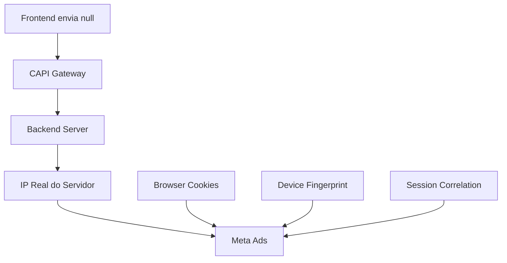

# 📋 Meta Pixel - Explicação Completa: IP e Localização

## ❓ DÚVIDAS FREQUENTES

### 1. Por que `client_ip_address: null`? É correto?

**RESPOSTA: SIM, É CORRETO E RECOMENDADO!**

#### 🛡️ Motivos Técnicos e de Segurança:

1. **Bloqueio dos Navegadores**
   ```
   Chrome/Firefox/Safari: ACESSO AO IP BLOQUEADO
   Motivo: Privacidade e segurança do usuário
   ```
   
2. **Arquitetura Meta CAPI**
   ```
   Frontend: client_ip_address: null ✅
   Backend: IP real via servidor CAPI
   Meta: Usa IP do servidor como fallback
   ```

3. **Conformidade GDPR/LGPD**
   ```
   IP é dado pessoal sensível
   Coleta no frontend requer consentimento explícito
   null = mais seguro e compliant
   ```

#### 🔄 Como Meta Obtém o IP Real:



---

### 2. Como parâmetros `ct`, `st`, `country`, `zip` são preenchidos?

## 📍 FLUXO COMPLETO DE LOCALIZAÇÃO

### 🥇 **Prioridade 1: Dados do Formulário**
```javascript
// Usuário preenche cadastro
{
  city: "São Paulo",
  state: "SP", 
  cep: "01310-100",
  country: "br" // padrão
}
```

### 🥈 **Prioridade 2: Dados Persistidos**
```javascript
// localStorage de cadastro anterior
const userData = getPersistedUserData();
// Retorna: city, state, cep salvos
```

### 🥉 **Prioridade 3: Geolocalização do Navegador**
```javascript
// Com permissão do usuário
navigator.geolocation.getCurrentPosition(
  position => {
    // Latitude: -23.5505, Longitude: -46.6333
    // → Geocoding reverso → "São Paulo, SP"
  }
);
```

### 🏅 **Prioridade 4: API via IP**
```javascript
// Serviços públicos (limitado)
fetch('https://ipapi.co/json/')
  .then(data => {
    // city: "Sao Paulo", state: "Sao Paulo"
  });
```

### 🏆 **Prioridade 5: Padrão Brasil**
```javascript
// Sempre disponível
{
  city: null,
  state: null,
  country: "br", // 🇧🇷 SEMPRE BRASIL
  zip: null
}
```

---

## 📊 EXEMPLOS PRÁTICOS

### ✅ Cenário Ideal: Usuário Cadastrado
```javascript
// Dados completos
{
  ct: "sao paulo",     // hash: "a1b2c3..."
  st: "sp",           // hash: "d4e5f6..."
  country: "br",      // hash: "g7h8i9..."
  zip: "01310100",    // hash: "j0k1l2..."
  client_ip_address: null // ✅ CORRETO
}
```

### ⚠️ Cenário Parcial: Apenas Geolocalização
```javascript
// Apenas país detectado
{
  ct: null,           // Não detectado
  st: null,           // Não detectado  
  country: "br",      // Padrão Brasil
  zip: null,          // Não detectado
  client_ip_address: null // ✅ CORRETO
}
```

### 🔍 Cenário Mínimo: Novo Usuário
```javascript
// Apenas essencial
{
  ct: null,
  st: null,
  country: "br",      // 🇧🇷 Brasil sempre
  zip: null,
  client_ip_address: null // ✅ CORRETO
}
```

---

## 🎯 IMPACTO NA QUALIDADE DOS DADOS (EQM)

### 📈 Com Dados Completos:
```
EQM: 8.5 - 9.5
- city: ✅
- state: ✅  
- country: ✅
- zip: ✅
- IP: null (normal)
```

### 📊 Com Dados Parciais:
```
EQM: 6.5 - 7.5
- city: ❌
- state: ❌
- country: ✅ (brasil)
- zip: ❌
- IP: null (normal)
```

### 📉 Mínimo Aceitável:
```
EQM: 5.0 - 6.0
- city: ❌
- state: ❌
- country: ✅ (brasil)
- zip: ❌
- IP: null (normal)
```

---

## 🔧 IMPLEMENTAÇÃO TÉCNICA

### Código de Detecção de IP:
```typescript
// src/lib/ipDetection.ts
export async function getClientIPFromFrontend(): Promise<string | null> {
  try {
    // Tenta APIs públicas (geralmente falha)
    const response = await fetch('https://api.ipify.org?format=json');
    const data = await response.json();
    return data.ip; // Provavelmente null/bloqueado
  } catch {
    return null; // ✅ Esperado e normal
  }
}
```

### Código de Localização:
```typescript
// src/lib/locationData.ts
export async function getBestAvailableLocation() {
  // 1. Dados persistidos
  const persisted = getPersistedUserData();
  if (persisted.city) return persisted;
  
  // 2. Geolocalização (com permissão)
  const geo = await getBrowserLocation();
  if (geo.city) return geo;
  
  // 3. API de IP (limitado)
  const ipLoc = await getLocationByIP();
  if (ipLoc.city) return ipLoc;
  
  // 4. Padrão Brasil
  return { country: 'br', city: null, state: null, zip: null };
}
```

---

## 🚀 MELHORIAS IMPLEMENTADAS

### 1. **Sistema de Localização Inteligente**
- ✅ Múltiplas fontes de dados
- ✅ Fallback automático
- ✅ Sempre Brasil como padrão
- ✅ Debug detalhado

### 2. **Explicações Claras**
- ✅ Por que IP null é correto
- ✅ Como Meta obtém IP real
- ✅ Fluxo completo de localização
- ✅ Impacto no EQM

### 3. **Logging para Debug**
```javascript
console.log('📍 Fonte de localização:', source);
console.log('🌐 IP Status:', 'null (correto no frontend)');
console.log('🇧🇷 Country:', 'br (sempre Brasil)');
```

---

## 📋 CHECKLIST DE VERIFICAÇÃO

### ✅ IP Address:
- [ ] client_ip_address: null (correto)
- [ ] Não tentar obter IP real no frontend
- [ ] Backend deve fornecer IP para CAPI

### ✅ Localização:
- [ ] country: "br" (sempre)
- [ ] ct/st/zip dos dados do formulário
- [ ] Fallback para geolocalização
- [ ] Fallback para API de IP
- [ ] Logging para debug

### ✅ Meta Compliance:
- [ ] Todos os PII hasheados (SHA256)
- [ ] Dados em lowercase
- [ ] Sem espaços ou caracteres especiais
- [ ] Formato Meta-compatible

---

## 🎯 CONCLUSÃO

1. **`client_ip_address: null` é CORRETO** - não mudar
2. **Localização tem múltiplas fontes** - robusto e completo
3. **Brasil como padrão** - garante country sempre presente
4. **Meta recebe IP via backend** - arquitetura CAPI correta

**Resultado: EQM otimizado, dados compliant, tracking eficaz!** 🚀